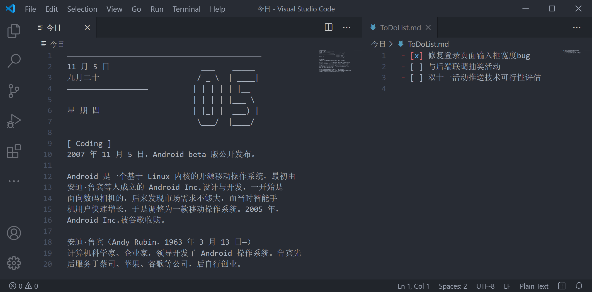

# 编程日历

编程日历是《了不起的程序员2021》编程日历配套的 VS Code 日历扩展，这个扩展每天可以向你展示一个包含多个「计算机—互联网—人工智能—程序设计」史上里程碑事件的日历页面。扩展展示的内容与《了不起的程序员2021》实体纸质版编程日历一致（但不包含纸质版日历中的插画）。

同时在右侧会打开一个 To Do List 文件供记录当天的任务列表，这和纸质版《了不起的程序员2021》编程日历提供的笔记功能类似。

你可以通过点击 VS Code 右下角的日历图标打开今日日历，还可以通过在命令面板中（Command Palette，按 Ctrl + Shift + P 打开）的编程日历命令打开今日、明日、昨日、本周和上周的日历。

《了不起的程序员2021》纸质版实体编程日历可以在各大电商渠道购买。

